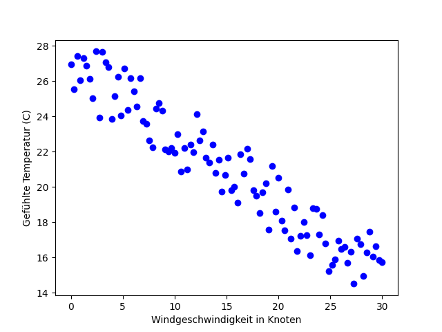
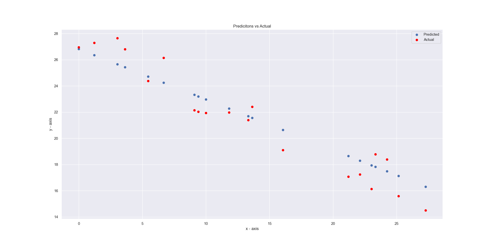

# TagDerInformatik22

  

###Toy Data example:
dfkndlfd
Predicting the apparent temperature based on the wind speed.
Actual temperature is ~27 C.

- Assumption: with more wind it feels colder

### Output prediction

---

### Linear regression on live data (multidimensional)
- Datensatz von:
​https://www.kaggle.com/datasets/budincsevity/szeged-weather

- Abzulegen unter/als 
    > data/weatherHistory.csv